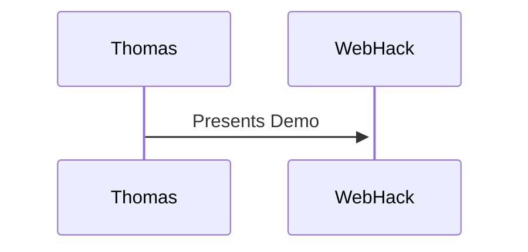

## Regular Markdown
- [ ] Todo
- [x] Items
- [!] And if using common themes
- [*] support for
- [p] additional states
(Full list available of [Obsidian Things Theme](https://github.com/colineckert/obsidian-things) options at [Checkbox Styling](https://github.com/colineckert/obsidian-things#checkbox-styling))

* **Lists**
* *of*
* <u>items</u>

| Tables | of                                       | Things |
| ------ | ---------------------------------------- | ------ |
| #tags  | [External Links](https://www.google.com) |        |


```ts
const codeBlocks = true
```

**Images**
![[Pasted image 20231121163202.png|100]]

---
## Additional Obsidian Formatting
> [!info]- You can add callouts
> with more info to enrich your notes
> > [!warning] and can even nest them!

%%Comments that are only visible when editing%%

**Mermaid Diagrams**


And LaTeX for math!
$$ \begin{vmatrix}a & b\\ c & d \end{vmatrix}=ad-bc $$

Even Excalidraw Diagrams
![[ObsidianDemo.excalidraw]]


---
<h2 style="color: blue">HTML and CSS</h1>


## FrontMatter
**Can be added inline**

SomeKey::SomeValue
foo::bar

These properties can be easily queried by scripts and plugins.

---
#### Links to this note generated by the [Dataview Plugin](https://github.com/blacksmithgu/obsidian-dataview)
```dataview
list from [[]] and !outgoing([[]])
```